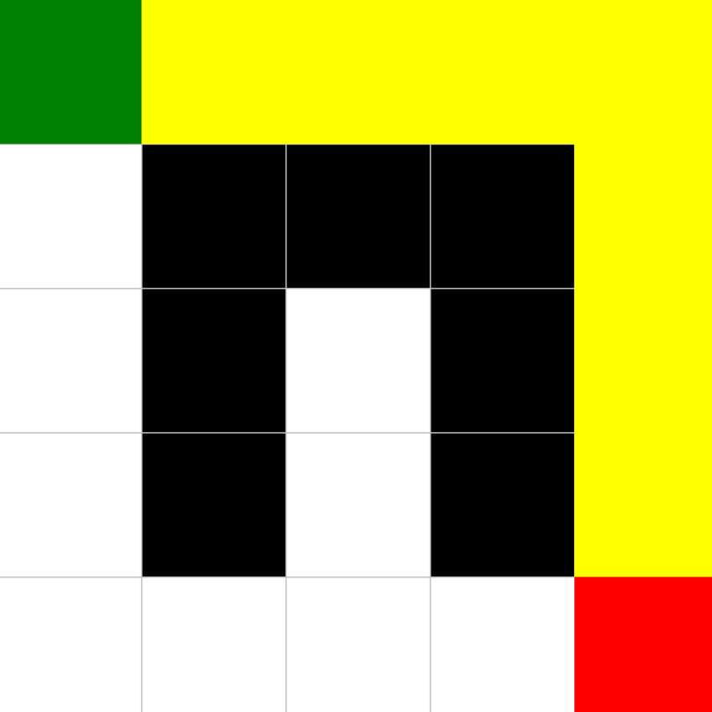

מטרת המשימה:
תכנות מונחה עצמים ואלגוריתמי BFS על מבני נתונים דו־ממדיים.

## תיאור כללי
בתרגיל זה מימשתי מחלקת מפה דו־ממדית Map2d ומספר אלגוריתמים ואפשרויות עבודה על מפות: מילוי שטח, חישוב מסלולים, חיפוש מרחקים, ציור צורות ועוד.  
בנוסף, נכתב ממשק גרפי בסיסי שמציג מפות ונתיב קצר ביותר בין שתי נקודות.

---

## מבנה הפרויקט
כל קבצי הקוד נמצאים בתוך src/assignments/Ex2/:

בתיקייה נמצאים הקבצים:

- Map2D.java – ממשק מפה דו־ממדית
- Pixel2D.java – ממשק לייצוג נקודה (פיקסל)
- Index2D.java – מחלקה המממשת Pixel2D
- Map.java – מימוש מלא של המפה והאלגוריתמים הנדרשים
- Ex2_GUI.java – ממשק גרפי להצגת המפה והמסלול
- StdDraw.java – ספריית ציור גרפי שסופקה בתרגיל
- MapTest.java – בדיקות המקור שניתנו בקובץ המרצה
- MapStudentTest.java – בדיקות נוספות שנכתבו על־ידי
- Index2DTest.java – בדיקות עבור מחלקת Index2D

---

## יכולות המפה (Map.java)

### פעולות בסיסיות
- יצירת מפה ריקה בגודל נתון
- יצירת מפה מתוך מערך דו־ממדי
- קבלת ערך בתא
- עדכון ערך בתא
- בדיקה האם פיקסל בתוך גבולות המפה
- השוואת שתי מפות
- הוספת מפה למפה אחרת
- כפל כל התאים בסקלר
- שינוי קנה מידה של המפה (rescale)

### פעולות ציור
- ציור קו בין שתי נקודות
- ציור עיגול מלא
- ציור מלבן

### אלגוריתמים מבוססי BFS
- fill – מילוי שטח מחובר (Flood Fill), כולל תמיכה במיפוי מחזורי (cyclic)
- allDistance – חישוב מרחקים מכל תא אפשרי לנקודה התחלתית
- shortestPath – מציאת מסלול קצר ביותר בין שתי נקודות במפה

---

## הממשק הגרפי (Ex2_GUI)
הממשק מציג מפה דו־ממדית באמצעות StdDraw:

- שחור = קיר/מחסום
- לבן = תא פנוי
- מסלול מודגש בצבע נוסף
- נקודת התחלה וסיום מוצגות על המפה

הקוד מאפשר להריץ דוגמה בסיסית ולראות ויזואליזציה של BFS והמסלול.

---

## בדיקות (JUnit)
נכתבו בדיקות עבור:

- Map – בדיקות למילוי, שינוי קנה מידה, השוואה, הוספה ועוד
- Index2D – בדיקות לפונקציות בסיסיות
- בדיקות המרצה – נכללות גם כן

כל הבדיקות רצות בהצלחה.

שם הסטודנטית:
שיראל כהן 
